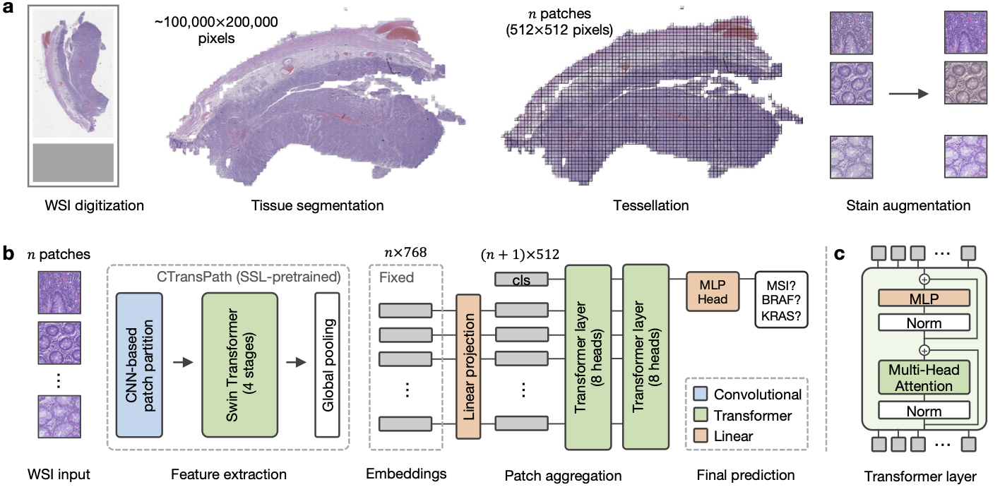

# HistoBistro

Pipeline for weakly-supervised learning on histology images. The pipeline contains various models for multiple instance learning with different aggregation models. Based on Pytorch Lightning. All aggregation modules can be loaded as model files in the classifier lightning module. Loss, models, optimizers, and schedulers can be specified as strings according to the PyTorch name in the config file.



## Repository structure
```
├── CancerCellCRCTransformer        # materials for the publication
├── models                          # all model files
│   ├── aggregators
│   │   ├── __init__.py  
│   │   ├── aggregator              # base class for aggregation modules 
│   │   ├── attentionmil.py         # model by Ilse et al., 2018
│   │   ├── lamil.py                # model by Reisenbüchler er al., 2022
│   │   ├── model_utils.py          # common layers and functions used in the other models
│   │   ├── perceiver.py            # model by Jaegle et al., 2021
│   │   ├── test_aggregators.py     # test new aggregators
│   │   ├── transformer.py          # CancerCellCRCTransformer model
│   │   ├── transmil.py             # model by Shao et al. 2021
├── classifier.py                   # lightning module for feature classification
├── config.yaml                     # config file for training
├── data.py                         # dataset class and helper functions
├── environment.yaml                # config file for conda environment
├── main.py                         # train and test models
├── train_k-fold.py                 # train models with k-fold cross validation
├── test_k-fold.py                  # test models with k-fold cross validation
├── test.py                         # test models (e.g., CancerCellCRCTransformer models)
├── options.py                      # argument parsing, overrides config file when arguments are given
├── Evaluations.ipynb               # visualize attention and classification score heatmaps
├── Visualizations.ipynb            # plot metric curves (ROC, PRC) and analyze clinicopathological features
├── utils.py                        # get files and other utils
```

## Setup

Setup `data_config.yaml` and `config.yaml` with your data paths and training configurations. All entries in brackets `< >` should be customized.

Install the following packages needed for a minimal working environement:
* mamba/conda: `pytorch pytorch-lightning wandb einops pyparsing h5py pandas`
* pip: `dgl`

Alternatively, install the conda env from `environment.yaml`:
```sh
conda env create --file environment.yaml
```

## Data structure

* `clini_table.xlsx`: Table (Excel-file) with clinically important labels. Each patient has a unique entry, column names `PATIENT` and `TARGET` are required.

| PATIENT	| TARGET	| GENDER	| AGE |
| ---       | ---       | ---       | --- |
| ID_345    | positive	| female	| 61  |
| ID_459    | negative	| male	    | 67  |
| ID_697    | NA	    | female	| 42  |

* `slide.csv`: Table (csv-file) with patient id's matched with slide / file names (column names `FILENAME` and `PATIENT`). Patients can have multiple entries if they have multiple slides.

| FILENAME	| PATIENT	|
| ---       | ---       |
| ID_345_slide01    | ID_345    |
| ID_345_slide02    | ID_345    |
| ID_459_slide01    | ID_459    |

* folder with features as `.h5-files`. Filenames correspond to filenames in `slide.csv`


## Training

You can train your model on a multi-centric dataset with the following k-fold cross validation (k=5) scheme where `--` (train) `**` (val), and `##` (test).
```
[--|--|--|**|##]
[--|--|**|##|--]
[--|**|##|--|--]
[**|##|--|--|--]
[##|--|--|--|**]
```

by running 
```
python train_k-fold.py --name <name> --data_config <path/to/data_config.yaml> --config <path/to/config.yaml>
```
and test it on the in-domain test set and external cohorts by running
```
python test_k-fold.py --name <name> --data_config <path/to/data_config.yaml> --config <path/to/config.yaml>
```

## Testing

You can test a given model with the following command:
```
python test.py --model_path <path/to/model.ckpt> --name <custom-name> --config_file <path/to/config.yaml> --data_config <path/to/data_config.yaml>
```

You can find the models for **MSI high**, **BRAF**, and **KRAS** prediction from the publication "Transformer-based biomarker prediction from colorectal cancer histology: A large-scale multicentric study" trained on the multicentric cohort in the folder `CancerCellCRCTransformer/trained_models` in this repo.

## Publications

Information to publications based on this repository are grouped in the respective folders. Find more detailed information in the README.md files in the respective folders.

If you consider this useful for your research, please cite our paper:
```
@article{wagner2023transformer,
  title={Transformer-based biomarker prediction from colorectal cancer histology: A large-scale multicentric study},
  author={Wagner, Sophia J and Reisenb{\"u}chler, Daniel and West, Nicholas P and Niehues, Jan Moritz and Zhu, Jiefu and Foersch, Sebastian and Veldhuizen, Gregory Patrick and Quirke, Philip and Grabsch, Heike I and van den Brandt, Piet A and others},
  journal={Cancer Cell},
  publisher={Elsevier}
}
```


